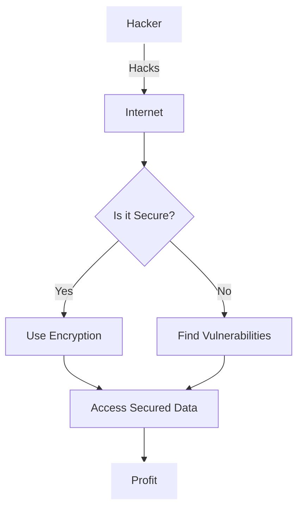

# Github training material

This repository contains a few resources which might be helpful when learning more about git/Github.

## Getting started

> [Markdown guide](https://www.markdownguide.org/)
